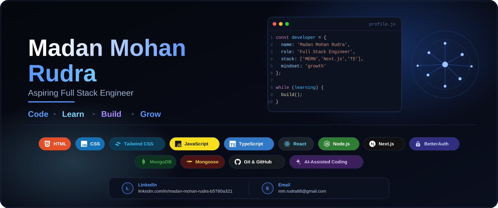

<!-- Replace assets/banner.png with your banner image -->

 

---

## 👋 About Me

- 💻 Aspiring Full Stack Engineer focused on modern web development
- 🌱 Currently learning React, TypeScript, Next.js and Node.js
- 🛠️ Building projects to improve practical development skills
- 🎨 Interested in clean, responsive and user-friendly interfaces
- 🤖 Exploring AI-assisted development and modern developer tools
- 📚 Continuously learning and experimenting with new technologies

---

## 🧰 Tech Stack

  

---

## 📊 GitHub Analytics

 

---

## 🔥 Contribution Activity

---

## 📈 Contribution Graph

---

## 📫 Connect With Me

---

### 💡 Code • Learn • Build • Grow

*"Keep learning. Keep building. Keep improving."*

